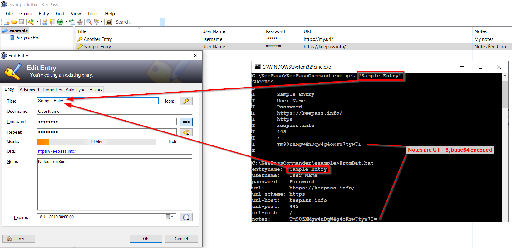

# KeePass Commander
KeePass Commander is a plugin for the [KeePass password store](https://keepass.info/ "KeePass"). 
It's purpose is to provide a communication channel for php-scripts, bat-files, powershell, ... to be able to query the KeePass password store from the commandline without configuration and without password.



# Download binary
For Windows (.NET framework 3.5 / .NET framework 4), [the latest version can be found here](https://github.com/MircoBabin/KeePassCommander/releases/latest "Lastest Version").
The plugin works with KeePass 2.41. Because the plugin barely uses anything from KeePass, it will probably work with all future KeePass versions.

Download the zip and unpack it in the KeePass directory where KeePass.exe is located.

The minimum .NET framework required is 3.5. This is the first framework to implement the System.IO.Pipes namespace.

# Help

Execute **KeePassCommand.exe** without parameters to view the help.

```
KeePassCommand 2.0 [build 2019-11-08 07:30:46]
https://github.com/MircoBabin/KeePassCommander - MIT license

KeePass Commander is a plugin for the KeePass password store (https://keepass.info/).
It's purpose is to provide a communication channel for php-scripts, bat-files, powershell, ... to be able to query the KeePass password store from the commandline without configuration and without password.

Syntax: KeePassCommand.exe <command> {-out:outputfilename OR -out-utf8:outputfilename} ...
- Unless -out or -out-utf8 is used, output will be at the console (STDOUT).
- When -out-utf8:outputfile is used, output will be written in outputfile using UTF-8 codepage.
- When -out:outputfile is used, output will be written in outputfile using ANSI codepage.
- "KeePass-entry-title" must exactly match (case sensitive), there is no fuzzy logic. All open databases in KeePass are searched.
- When the expected "KeePass-entry-title" is not found (you know it must be there), you can assume KeePass is not started or the required database is not opened.

* Basic get
KeePassCommand.exe get "KeePass-entry-title" "KeePass-entry-title" ...
e.g. KeePassCommand.exe get "Sample Entry"
- "Notes" are outputted as UTF-8, base64 encoded.

* Advanced get string field
KeePassCommand.exe getfield "KeePass-entry-title" "fieldname" "fieldname" ...
e.g. KeePassCommand.exe getfield "Sample Entry" "extra field 1" "extra password 1"

* Advanced get file attachment
KeePassCommand.exe getattachment "KeePass-entry-title" "attachmentname" "attachmentname" ...
e.g. KeePassCommand.exe getattachment "Sample Entry" "example_attachment.txt"
- Attachment is outputted as binary, base64 encoded.

* Advanced get file attachment raw into file
KeePassCommand.exe getattachmentraw -out:outputfilename "KeePass-entry-title" "attachmentname"
e.g. KeePassCommand.exe getattachmentraw -out:myfile.txt "Sample Entry" "example_attachment.txt"
- Attachment is saved in outputfilename, outputted as binary.

* Advanced get notes
KeePassCommand.exe getnote "KeePass-entry-title" "KeePass-entry-title" ...
e.g. KeePassCommand.exe getnote "Sample Entry"
- "Notes" are outputted as UTF-8, base64 encoded.

* Advanced get notes into file
KeePassCommand.exe getnoteraw <-out-utf8:outputfile or -out:> "KeePass-entry-title"
e.g. KeePassCommand.exe getnoteraw -out-utf8:mynote.txt "Sample Entry"
- With -out-utf8, "Notes" are outputted as UTF-8.
- With -out, "Notes" are outputted in ANSI codepage.

```

# Examples

Examples are found in the github directory **example**.

- example.kdbx is a KeePass database. It's master password is **example**.
- [FromPhp.php](example/FromPhp.php) can be used to query the KeePass password store from PHP. With minimal modifications you can use it anywhere.
- [FromBat.bat](example/FromBat.bat) can be used to query the KeePass password store from a BAT file. With minimal modifications you can use it anywhere.
- [FromPowershell.ps1](example/FromPowershell.ps1) can be used to query the KeePass password store from PowerShell. With minimal modifications you can use it anywhere.


# Why
The plugin [KeePassHttp](https://github.com/pfn/keepasshttp/) already exists for querying the password store. 
I did not want to use this plugin, because it embeds a http server inside KeePass. 
And I don't want to "pair" with a code, because I want to communicate from the commandline, without configuration.

So I build KeePassCommander.dll plugin which runs a Windows named-pipe-server inside KeePass. And a KeePassCommand.exe commandline tool to communicate with KeePassCommander.dll. 

I'm using this plugin among other things to automate DeployHQ. In KeePass I store the DeployHQ API key. From a php script the API key is queried and then used. 

# Contributions
Contributions are welcome. Please read [CONTRIBUTING.md](CONTRIBUTING.md "contributing") before making any contribution!

# License
[The license is MIT.](LICENSE.md "license")


